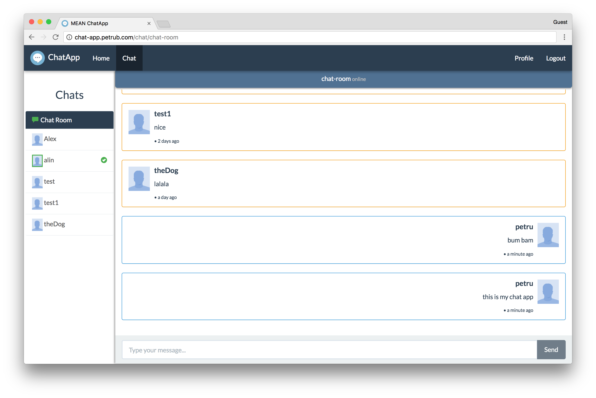

# MEAN Chat App

> A small chat application built using the **MEAN** stack

- Feel free to try the live demo at http://petrub.com/chat-app

# Features

- Register and authenticate users using JSON web tokens

- Join a common room where you can chat with all the registered users

- Open 1on1 private conversations with a user of your choice

- Notifications for messages on background conversations

- Have a pleasant UI/UX built to look awesome from mobile to desktop

<p align="center">
  
</p>

# Getting started

### Prerequisites

> if you don't know what you are doing go on the website and follow the instructions, those are pretty straight forward

- [NodeJS](https://nodejs.org)
- [MongoDB](https://www.mongodb.com/)
- [Angular-CLI](https://cli.angular.io/)

```bash
# clone the repo
git clone https://github.com/petr166/mean-chat-app.git

# change into the repo directory
cd mean-chat-app

# !! create .env file with the model from .env.example !!

# install server dependencies
npm install

# change into the angular src directory
cd angular-src

# install frontend dependencies
npm install

# start the server
cd ../ && npm run dev

# in another terminal window
cd <App folder>/angular-src && npm start
```

Then visit http://localhost:4200 in your browser.

# Technologies

- [NodeJS](https://nodejs.org/) - JavaScript backend/server-side solution of choice

- [Express](https://expressjs.com/) - Node framework that makes handling http requests with ease

  - [JsonWebToken](https://www.npmjs.com/package/jsonwebtoken) - package that helps with generating JWTs for secure authentication

  - [PassportJS](http://passportjs.org/) - authentication middleware used to guard certain parts of the app for non-authenticated requests

- [MongoDB](https://www.mongodb.com/) - data storage solution that just speaks JSON and pairs very well with Node

  - [Mongoose](http://mongoosejs.com/) - package that helps with object modeling and manages connection between server and database

  - [Bcryptjs](https://www.npmjs.com/package/bcryptjs) - for salting and hashing the user password to be stored in the database

- [Socket.io](https://socket.io/) - web sockets implementation, fast and reliable real-time communication engine

- [Angular](https://angular.io/) - rich frontend web framework, helps creating fast, reliable web applications

  - [Angular-CLI](https://cli.angular.io/) - command line interface for streamlined angular development

  - [TypeScript](https://www.typescriptlang.org/) - superset of JavaScript that can be compiler-checked, also has types!!

  - [MomentJS](https://momentjs.com/) - JavaScript date/time parser

  - [Bootstrap](http://getbootstrap.com/) - CSS/JS framework, makes it easy to develop responsive, well polished web apps

# How it works

On the client-side users can create accounts that will be stored in the database. Then users can authenticate with the given credentials, if those are correct the server sends a unique token to the client. The client stores it for use on restricted backend route requests.

Once authenticated, the server creates a socket bidirectional connection with the client to facilitate the chat functionality.

Every time a user sends a message, this goes to the server which redirects it to the desired respondent. Also every time a user enters or leaves chat, the server announces all the connected clients.

# Motivation

This is a personal project with the purpose of better understanding the client-server communication paradigm, new web technologies, especially Angular :)

<p align="center">
  
</p>

# [Issues](https://github.com/petr166/mean-chat-app/issues)

If you want to help don't hesitate to come up with ideas, bug reports, make pull requests, all you can do. Also if you have any questions, please use the same issues page
